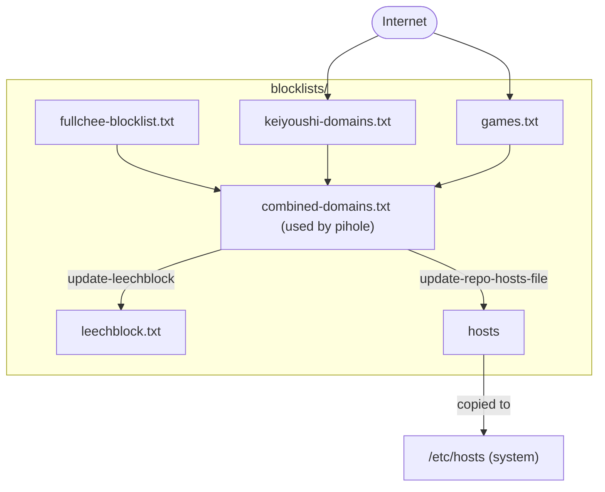

# Domain blocklists

## Setup

Run `just setup`

## Usage

1. Update `fullchee-blocklist.txt`
2. Commit the change (pre-commit: updates all the other files)
3. Update the consumers of the blocklists
   1. Pihole: update gravity <pihole.com/admin/gravity>, has the URL for `combined-domains.txt`
   2. LeechBlock: import `blocklists/leechblock.txt`

## Files

