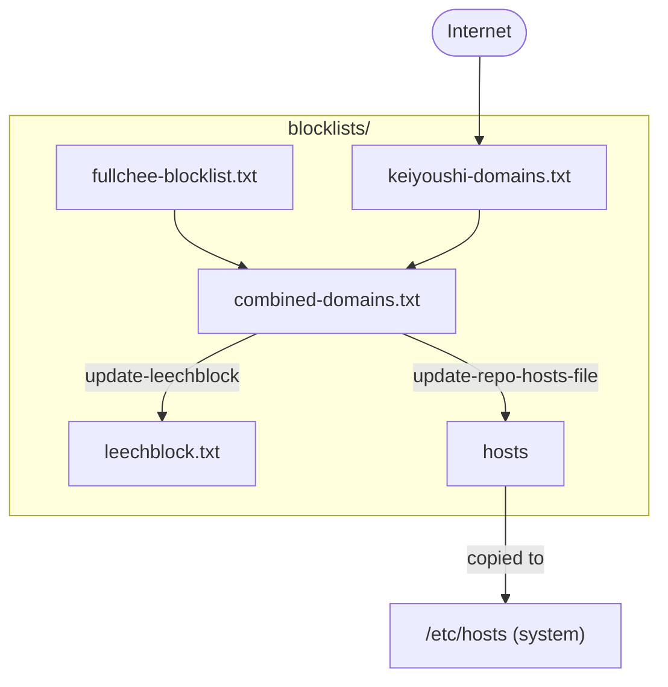

# Domain blocklists

## Setup

1. Install `just`
   1. `brew install just`
2. Install `prek`
   1. `brew install prek`
3. Enable pre-commit hooks (prek)
   1. `prek install` — repository-local hook runs `just` when files under `blocklists/` change (hook id: `just-blocklists`). To skip the hook for a commit: `SKIP=just-blocklists git commit -m "..."` or `git commit --no-verify`.

## Usage

1. Update `fullchee-blocklist.txt`
2. Commit the change (pre-commit: updates all the other files)
3. Update the consumers of the blocklists
   1. Pihole: update gravity <pihole.com/admin/gravity>, has the URL for `combined-domains.txt`
   2. LeechBlock: import `blocklists/leechblock.txt`

## Files

